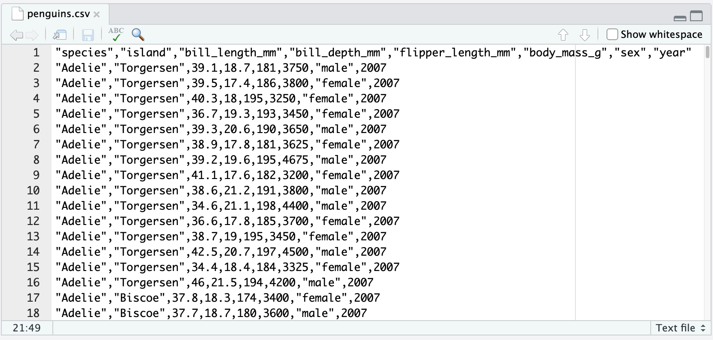
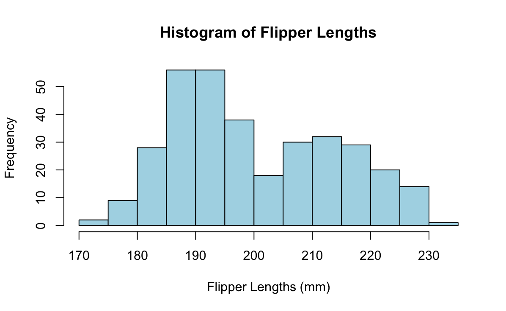
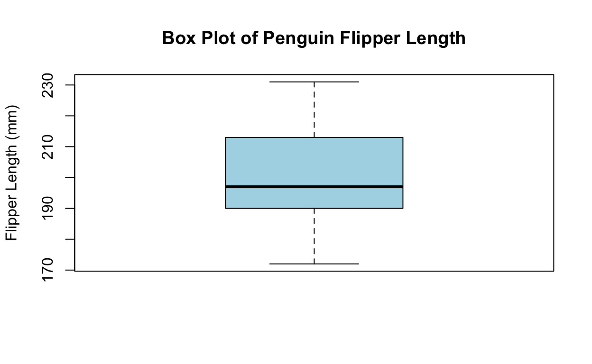

```{r setup, include=FALSE}
library(learnr)
library(fontawesome)
penguins_dataset <- read.csv("penguins.csv", stringsAsFactors = TRUE)
```


## Learning Objectives

### `R` Learning Objectives

1)  Review how to import data into R, and how to make a histogram in R
2)  Learn how to find the five-number summary of a variable, and find a specific numeric summary (statistic) in R
3)  Learn how to make a box plot in R
4)  Learn how to make side-by-side box plots in R


### Statistical Learning Objectives

1)  Understand when to histogram
2)  Understand when to make a box plot
3)  Understand when to make a side-by-side box plot and how to use this type of comparison
4)  Be able to use these graphical and numerical summaries to discuss data

### Functions covered in this lab

1)  `read.csv()`
2)  `head()`
3)  `str()`
4)  `summary()`
5)  `hist()`
6)  `min()`, `mean()`, `median()`, `max()`, `sd()`, `IQR()`
7)  `boxplot()`


## Palmer Penguins Dataset

### Introduction to the Dataset

For this lab, we'll primarily be exploring a somewhat famous dataset, often referred to as the "Palmer Penguins Dataset." Contained in the dataset is information on several different penguins encountered on three islands in the Palmer Archipelago in Antarctica. The data,collected by [Dr. Kristen Gorman](https://www.uaf.edu/cfos/people/faculty/detail/kristen-gorman.php) and the [Palmer Station, Antarctica LTER](https://pal.lternet.edu/), was prepared by [Dr. Allison Horst](https://github.com/allisonhorst/palmerpenguins).

{width="40%"}

The data itself is stored in the Lab02 folder, in a file called `penguins.csv`. Note that this is a CSV file, like we discussed in Lab01 - let's take a moment to re-familiarize ourselves with filetypes and data storage.

### Filetypes and Data Storage

In Lab01, we saw that data is often stored in one of several different **filetypes**, which are indicated in a file name by the suffix used. For example, a **comma-separated values** (CSV) file will always have a file name that ends in `.csv`. 

A typical CSV file has the following structure:

-   **Header Row:** the first row lists the names of the variables in the file.
-   **Subsequent Rows:** each row of the file is an "observation" or "case", and consists of one or more variables whose *values* are *separated* by *commas* (hence the name *comma separated values*)

As we saw in Lab01, the `read.csv()` function is used to "read in" a CSV file to R. ("Read in" is just programming jargon for "bring the dataset into R"). 

### Back to Penguins

If we were to open the raw file and view it in R, this is what we would see:

{width="70%"}


<div style="background-color:#ede7d8">
### `r fontawesome::fa("triangle-exclamation")` Caution

In general, it is **not recommended** to open and view raw files in `R` (or any other application). This is because most data these days is _extremely large_, and it can take a very long time for an application to open it. (Admittedly, the Palmer Penguins datset is relatively small so we don't have that problem, but we would like to impart good programming practices unto you.)
</div>

This reveals what we were saying before, about how _values_ in a CSV file are _separated_ by _commas_; within each row (often called an **observation**), the datapoints we have for each variable are separated with a comma. This is what makes this file a CSV file!

As we saw in Lab01, CSV files can be read in using `read.csv()`. Let's read in the `penguins.csv` file together:
```{r}
penguins_dataset <- read.csv("penguins.csv", stringsAsFactors = TRUE)
```

`r fontawesome::fa("magnifying-glass")` **What Is This Code Doing?**

-   `read.csv()` loads the dataset into `R`
    -   `"penguins.csv"` is called a **filepath**, and tells R what the name of the file we want to read in is
    -   `stringsAsFactors`: we'll talk about that in a bit
-   We are then assigning the loaded-in dataset to a variable, called `penguins_dataset`

`r fontawesome::fa("magnifying-glass")` **What Does `stringsAsFactors` Do?**

-   **Strings:** Words or phrases in the data
-   **Factors:** Levels of a categorical variable
-   Setting `stringsAsFactors = TRUE` tells R to treat words or phrases as **categorical variables.**

In a real-world setting, it is up to you to decide whether it makes sense to use `stringsAsFactors = TRUE` or `stringsAsFactors = FALSE`. For example, if one of your variables contains written responses from a survey, you may not want to treat that as a categorical variable (and instead treat it as just words).

<div style="background-color:#dfedf7">
### `r fontawesome::fa("angles-left")` TryIt1 (Review)

How many non-header rows are in the `penguins.csv` file? **Hint:** don't open the file and count the rows manually; instead, use the `penguins_dataset` variable we created above, and recall a function from Homework 1 that will enable you to count the number of rows in a dataset.

```{r tryIt1, exercise = TRUE, error = T}
## Replace this line with your code
```

```{r tryIt1-solution}
nrow(penguins_dataset)
```

</div>


## Exploring a Dataset

Many data scientists agree that the first step in any exploration of a dataset (after reading in the data!) is something called **Exploratory Data Analysis** (EDA). As the name perhaps suggests, this essentially translates to: "get to know the dataset a bit!"

### Sneaking a Peek

As mentioned previously, it's usually advised against to open a full datset. However, it can sometimes be insightful to take a look at the first few rows of a dataset. R has a built-in function that allows us to do this, called `head()`. 

<div style="background-color:#dfedf7">
### `r fontawesome::fa("laptop-code")` TryIt2

Display the first six rows of the `penguins_dataset` variable, using the `head()` function.
```{r tryIt2, exercise = TRUE, error = T}
# Replace this line with your code

```

```{r tryIt2-solution}
head(penguins_dataset)
```
</div>

If we want to see more or fewer than six rows, we can pass an additional argument into our call to `head()` specifying the number of rows we want to see.

<div style="background-color:#dfedf7">
### `r fontawesome::fa("laptop-code")` TryIt3

Display the first **four** rows of the `penguins_dataset` variable, using the `head()` function. **Hint:** look up the help file for `head()`, and figure out what argument you can specify to achieve this.

```{r tryIt3, exercise = TRUE, error = T}
# Replace this line with your code

```

```{r tryIt3-solution}
head(penguins_dataset, n = 4)
```
</div>

### Structure

Here is a brief description of the variables contained in the Palmer Penguins dataset:

| Variable name | Description |
|:---------------------------|:-------------------------------------------|
| `species` | Penguin species (Adélie, Chinstrap, Gentoo) |
| `island` | Island in the Palmer Archipelago (Biscoe, Dream, Torgersen) |
| `bill_length_mm` | Bill length (in mm) |
| `bill_depth_mm` | Bill depth (in mm) |
| `flipper_length_mm` | Flipper length (in mm) |
| `body_mass_g` | Penguin body mass (in grams) |
| `sex` | Penguin sex (female, male) |
| `year` | Study year (2007, 2008, 2009) |

Suppose we want to confirm that our `penguins_datset` _variable_ contains the same information as we expect it to. One way we can do this is by examining the **structure** of the `penguins_dataset` variable, using the function `str()` (which is short for "*str*ucture").

<div style="background-color:#dfedf7">
### `r fontawesome::fa("laptop-code")` TryIt4

Explore the structure of the `penguins_dataset` variable using the `str()` function. Remember that you can always look up the help file for a function if you're confused on how to use it!

```{r tryIt4, exercise = TRUE, error = T}
# Replace this line with your code

```

```{r tryIt4-solution}
str(penguins_dataset)
```
</div>


## Statistical Summaries

In Lab01, we started getting a feel for conducting statistical summaries using `R`. Specifically, we saw how the `mean()` and `median()` functions can help us compute the mean and median, respectively, of a list of numbers. 

We also saw how the dollar sign symbol (`$`) can be used to extract columns of a dataset. This motivates us to explore different variables of the Palmer Penguins dataset by extracting out relevant columns of the `penguins_dataset` variable and passing them into relevant statistical functions. 

For example, the mean flipper length of all penguins in the dataset is:
```{r}
mean(penguins_dataset$flipper_length_mm)
```

`r fontawesome::fa("magnifying-glass")` **What Is This Code Doing?**

-   `penguins_dataset$flipper_length_mm` extracts out the `flipper_length_mm` column from the `penguins_dataset` variable, which we know contains observations on the flipper lengths (in mm) of the various penguins included in the dataset.
-   Passing this into a call to `mean()` calculates the _mean_ of this dataset, resulting in the _mean flipper length of all penguins included in the dataset_


Similarly, the median flipper length of all penguins in the dataset is:
```{r}
median(penguins_dataset$flipper_length_mm)
```

Rather than calculating different statistical summaries separately, we can use the `summary()` function to simultaneously compute several statistical quantities:

```{r flipperSummaries}
summary(penguins_dataset$flipper_length_mm)
```

Note that our mean and median calculation using `mean()` and `median()` agree with those performed by `summary()`! We can still compute individual summary statistics using specific functions.

<div style="background-color:#dfedf7">
### `r fontawesome::fa("laptop-code")` TryIt6

Run the following. Make sure you understand what quantity each line is computing!

```{r tryIt6, exercise = TRUE, error = T}
min(penguins_dataset$flipper_length_mm, na.rm = T)
mean(penguins_dataset$flipper_length_mm, na.rm = T)
median(penguins_dataset$flipper_length_mm, na.rm = T)
max(penguins_dataset$flipper_length_mm, na.rm = T)
sd(penguins_dataset$flipper_length_mm, na.rm = T)
IQR(penguins_dataset$flipper_length_mm, na.rm = T)
```
</div>

## Histograms

In Lab01, we saw how the `hist()` function can be used to generate a histogram from a list of numbers. 


<div style="background-color:#dfedf7">
### `r fontawesome::fa("laptop-code")` TryIt7

Generate a histogram of the flipper lengths (in mm) of the penguins in the Palmer Penguins dataset. Make sure to include a descriptive x-axis label, and a descriptive title. **Hint:** Recall that the variable that stores our data is called `penguins_dataset`, and that the relevant column is called `flipper_length_mm`. 

<a style="color:red"><b>IMPORTANT NOTE</b></a> If your code is not running, this may be due to a server issue. In that case:

1)  Type your code into the box provided below
2)  Copy this code to your Console and run it from there

```{r tryIt7, exercise = TRUE, error = T}
## Replace this line with your code
```

```{r tryIt7-solution}
hist(penguins_dataset$flipper_length_mm,
     main = "Histogram of Flipper Lengths",
     xlab = "Flipper Lengths (mm)")
```
</div>

The `hist()` function comes with many options for customization!


<div style="background-color:#dfedf7">
### `r fontawesome::fa("laptop-code")` TryIt8

Modify your code from TryIt7 to color the bars of your histogram light blue. **Hint:** look up the help file for `hist()`; furthermore, R will understand the string `"lightblue"` to mean "light blue". 

<a style="color:red"><b>IMPORTANT NOTE</b></a> If your code is not running, this may be due to a server issue. In that case:

1)  Type your code into the box provided below
2)  Copy this code to your Console and run it from there

```{r tryIt8, exercise = TRUE, error = T}
## Replace this line with your code
```

```{r tryIt8-solution}
hist(penguins_dataset$flipper_length_mm,
     main = "Histogram of Flipper Lengths",
     xlab = "Flipper Lengths (mm)",
     col = "lightblue")
```
</div>

Recall, from Lecture, that we describe histograms using four main metrics:

1)  Shape (modes and symmetry)
2)  Outliers
3)  Center
4)  Spread/Variability

Use the mnemonic **SOCS**:

<span style="font-size: 18px"><a style="text-color:blue"><b>S</b></a>hape <a style="text-color:blue"><b>O</b></a>utliers <a style="text-color:blue"><b>C</b></a>enter <a style="text-color:blue"><b>S</b></a>pread</span>


**Note**: Always mention whether outliers are present. Not addressing them suggests you missed checking for them.

<div style="background-color:#dfedf7">
### `r fontawesome::fa("laptop-code")` TryIt9

For posterity, here is the histogram you were supposed to generate in TryIt8:

{width="65%"}

\

**Describe distribution of flipper lengths.**

```{r tryIt9, exercise = TRUE, error = T}
## DONT TYPE ANYTHING HERE.
## WHEN YOU ARE READY, CLICK "SOLUTIONS" TO SEE THE ANSWERS
```

```{r tryIt9-solution}
##  The histogram of flipper length appears to be bimodal, suggesting that there are two subgroups in the penguins data set. One of the peaks appears to center around 190 mm, and the other centers around 215 mm. The flipper lengths range from about 170 to 235 mm. None of the flipper lengths appear to be outliers that stand far away from the rest of the data points
```
</div>

\

<div style="background-color:#dfedf7">
### `r fontawesome::fa("laptop-code")` TryIt10

**Do you think that the mean is the best measure of center for the flipper lengths? Why or why not?**

```{r tryIt10, exercise = TRUE, error = T}
## DONT TYPE ANYTHING HERE.
## WHEN YOU ARE READY, CLICK "SOLUTIONS" TO SEE THE ANSWERS
```

```{r tryIt10-solution}
## Since we saw a bimodal distribution of flipper lengths, there is not one overall measure of center that will be good to describe this distribution.
```
</div>


## Boxplots

A **box plot** is another effective way to visualize a quantitative variable. Creating a box plot in R is straightforward: use the `boxplot()` function.

Just like with histograms, always include a title (`main`) and axis labels (`ylab`) to make your plot clear and informative.

{width="65%"}


<div style="background-color:#dfedf7">
### `r fontawesome::fa("laptop-code")` TryIt11

Use the `boxplot()` function to produce the boxplot shown above. 


<a style="color:red"><b>IMPORTANT NOTE</b></a> If your code is not running, this may be due to a server issue. In that case:

1)  Type your code into the box provided below
2)  Copy this code to your Console and run it from there

```{r tryIt11, exercise = TRUE, error = T}
## Replace this line with your answers
```

```{r tryIt11-solution}
boxplot(penguins_dataset$flipper_length_mm,
        main = "Box Plot of Penguin Flipper Length",
        ylab = "Flipper Length (mm)",
        col = "lightblue")
```
</div>

\

<div style="background-color:#dfedf7">
### `r fontawesome::fa("laptop-code")` TryIt12

**True or False:** The box plot of flipper lengths appears to be unimodal and symmetric.

```{r tryIt12, exercise = TRUE, error = T}
## DONT TYPE ANYTHING HERE.
## WHEN YOU ARE READY, CLICK "SOLUTIONS" TO SEE THE ANSWERS
```

```{r tryIt12-solution}
## False! We cannot determine the number of modes from a box plot. In terms of symmetry, it's difficult to tell with this distribution. The median is a little lower than the center of the box, which suggests the distribution might be skewed to the right, but the "whiskers" look to be about the same size which might suggest symmetry.
```
</div>

\


<div style="background-color:#dfedf7">
### `r fontawesome::fa("laptop-code")` TryIt13

Are there any outlier flipper lengths? How can you tell (make reference to the boxplot you generated in the TryIt12 exercise above!)

```{r tryIt13, exercise = TRUE, error = T}
## DONT TYPE ANYTHING HERE.
## WHEN YOU ARE READY, CLICK "SOLUTIONS" TO SEE THE ANSWERS
```

```{r tryIt13-solution}
## There are no outlier flipper lengths, because the boxplot does not contain any points separated from the box.
```
</div>

\

If there are outliers present, they will appear as points separated from the boxplot:

```{r}
set.seed(5)
boxplot(rt(40, df = 2),
        main = "Example Boxplot",
        ylab = "Mock Data",
        col = "lightblue")
```

**Remember:** When checking for outliers, be sure to check a histogram as well!

### Side-by-Side Boxplots

To compare a numerical variable and a categorical one, we can use a **side-by-side boxplot**. For example, consider the following mock dataset, containing fictional commute times of UCSB students, grouped by standing:

```{r commute_times_example}
commute_times <- read.csv("commute_times.csv")
head(commute_times)
```

If we want to make a boxplot with a categorical variable `x` on the _x_axis and a numerical variable `y` on the _y_axis, we use the syntax

```{r eval = F}
boxplot(y ~ x)
```

For example, a plot of commute times across standings is generated using:

```{r}
boxplot(commute_times$commute_time ~ commute_times$standing,
        main = "Commute Times Across Standings",
        xlab = "Standing",
        ylab = "Commute Times (mins)",
        col = palette.colors(5)[2:5])
```

**NTS:** Talk about the order of the categories (maybe don't say "ordered factor" - just ask, how was this organized?)


<div style="background-color:#eaf0e4">
### `r fontawesome::fa("lightbulb")` ProTip
The command `palette.colors()` gives you access to a list of nine colorblind-friendly colors. That is, these 9 colors have been specifically selected to be accessible to persons with colorblind vision deficiency (CVD).
</div>


<div style="background-color:#dfedf7">
### `r fontawesome::fa("laptop-code")` TryIt14

Make a side-by-side boxplot of **bill lengths** across species. Does it appear that a penguin's bill length is related to its species, for the penguins in Palmer Archipelago? Why or why not?

```{r tryIt14, exercise = TRUE, error = T}
## Replace this line with your answers
```

```{r tryIt14-solution}
boxplot(penguins_dataset$bill_length_mm ~ penguins_dataset$species,
        main = "Box Plots of Penguin Bill Length by Species",
        ylab = "Bill Length (mm)",
        xlab = "Species",
        col = palette.colors(5)[2:5])
```
</div>

## What's Next?

Congrats on finishing the Lab02 Tutorial! Here's what you need to do next.

1)    Navigate to the Lab02 folder on the PSTAT 5LS JupyterHub Server
2)    Make a copy of the file called `lab02_postlab.Rmd`; rename your copy `lab02_NETID_postlab.Rmd` where you replace `NETID` with your NetID (for example, my file would be called `lab02_epmarzban_postlab.Rmd` since my NetID is `epmarzban`)
3)    Fill out your copy of the Lab 02 Post-Lab.

### Next Time

During our next section meeting, we will explore some statistics collected by way of the survey we sent out over the weekend.